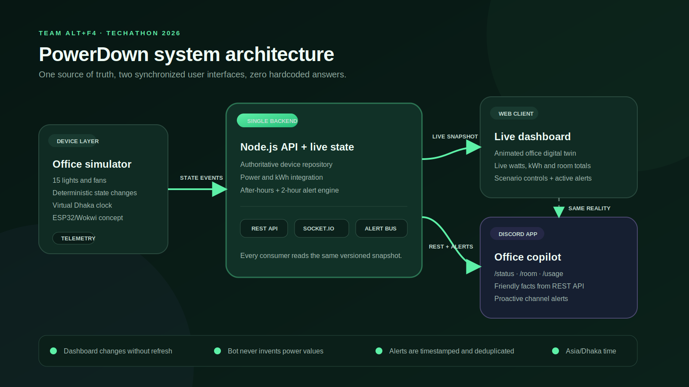

# PowerDown

### A real-time office energy digital twin by Team ALT+F4

PowerDown gives a small office one synchronized view of every light, fan and
energy anomaly. A live web dashboard and a Discord bot both read from the same
backend, so the numbers never disagree.

> **Official correction:** the office has 3 rooms × (2 fans + 3 lights) =
> **15 devices total**. References to 18 devices in the supplied PDF are stale
> arithmetic errors, confirmed by the organizer's correction email.



## Problem understanding

Employees sometimes leave lights and fans running after work. The boss needs:

- A live room-by-room device status view without page refreshes.
- Current office power and per-room breakdowns.
- Timestamped alerts for devices left on after 5 PM or an entire room running
  continuously for more than two hours.
- Friendly Discord answers backed by the same current state.
- A representative, electrically sensible hardware concept.

## Solution approach

The backend owns the only mutable device store. A deterministic simulator
produces realistic state transitions and integrates wattage over simulated time.
Socket.IO broadcasts a versioned snapshot to the dashboard, while the Discord
bot queries the same REST API. The alert engine also publishes newly triggered
alerts to a configured Discord channel.

The simulator uses 60W per fan and 15W per light. Therefore the mathematically
consistent maximum office load is:

```text
(6 fans × 60W) + (9 lights × 15W) = 495W
```

## Highlights

- Interactive top-view office digital twin
- Glowing ON lights and animated running fans
- 15 devices organized across exactly three rooms
- Real-time Socket.IO synchronization
- Live watts, integrated kWh, estimated cost and room breakdowns
- Deterministic Normal, After-hours, 2-hour Anomaly and Close Office scenarios
- Timestamped, deduplicated alert lifecycle
- Discord `/status`, `/room` and `/usage` commands
- Proactive Discord channel alerts
- ESP32 + five isolated relay channel Wokwi design
- Responsive UI and reduced-motion accessibility support

## Technology stack

| Layer | Technology |
|---|---|
| Dashboard | React, Vite, TypeScript, CSS |
| Backend | Node.js, Express, TypeScript |
| Realtime transport | Socket.IO |
| Discord integration | discord.js |
| Validation and tests | TypeScript, Vitest, Supertest |
| Hardware concept | ESP32, Wokwi, relay-isolated loads |
| Monorepo tooling | pnpm workspaces |

## Repository structure

```text
apps/
  web/       React realtime dashboard
  server/    REST API, Socket.IO, simulator, energy and alert engines
  bot/       Discord commands and proactive alerts
packages/
  shared/    Shared device contracts, room definitions and seed data
docs/
  architecture/  Non-Mermaid system diagram
hardware/
  wokwi/     Representative one-room ESP32 circuit and firmware
```

## Setup

### Prerequisites

- Node.js 22.12 or newer
- pnpm 9 or newer
- A Discord application for bot features

### Installation

```bash
git clone https://github.com/reza-05/Techathon2026-ALT-F4.git
cd Techathon2026-ALT-F4
pnpm install
cp .env.example .env
pnpm dev
```

Open `http://localhost:5173`. The API runs on `http://localhost:4000`.

The dashboard and backend can be run without Discord credentials:

```bash
pnpm dev:core
```

## Environment variables

| Variable | Required | Purpose |
|---|---|---|
| `PORT` | No | API port, defaults to `4000` |
| `WEB_ORIGIN` | No | Allowed dashboard origin |
| `VITE_API_URL` | No | Browser-facing backend URL |
| `DISCORD_TOKEN` | Bot | Discord bot token |
| `DISCORD_CLIENT_ID` | Bot | Discord application ID |
| `DISCORD_GUILD_ID` | No | Registers commands instantly in the demo server |
| `DISCORD_ALERT_CHANNEL_ID` | No | Enables proactive alert messages |
| `SERVER_API_URL` | No | Backend URL used by the bot |

Never commit the real `.env` file or Discord token.

## API endpoints

| Method | Endpoint | Purpose |
|---|---|---|
| `GET` | `/health` | Service health |
| `GET` | `/api/snapshot` | Complete versioned office state |
| `GET` | `/api/devices` | All 15 current device states |
| `GET` | `/api/rooms/:roomId` | One room and its five devices |
| `GET` | `/api/usage` | Office and room power/energy totals |
| `GET` | `/api/alerts` | Current active alerts |
| `POST` | `/api/devices/:deviceId/toggle` | Simulate one physical state change |
| `POST` | `/api/simulation/scenarios/:scenarioId` | Activate a deterministic demo |

The Socket.IO server emits a `snapshot` event on connection and after every
state transition. The `sequence` field lets consumers identify new snapshots.

## Discord setup

1. Create an application and bot in the Discord Developer Portal.
2. Copy `.env.example` to `.env` and add the token and application ID.
3. Add `DISCORD_GUILD_ID` for immediate command registration during the demo.
4. Invite the bot with `bot` and `applications.commands` scopes.
5. Add `DISCORD_ALERT_CHANNEL_ID` to enable proactive warnings.
6. Run `pnpm dev`.

The bot requests only the `Guilds` gateway intent. Commands read actual backend
data; no wattage or device status is hardcoded into a response.

## Simulation scenarios

| Scenario | Demonstrates |
|---|---|
| Normal day | Dynamic room activity and live power changes |
| After-hours leak | Work Room 2 left running at 8:30 PM |
| 2-hour anomaly | Every Work Room 1 device continuously ON for 2h 30m |
| Close office | All devices OFF and active alerts resolved |

All office-hour rules use the `Asia/Dhaka` timezone, independent of the machine
running the server.

## Hardware design

The [`hardware/wokwi`](hardware/wokwi) directory contains:

- `diagram.json` - ESP32, five SPDT state inputs, five isolated relay channels
  and five representative low-voltage loads.
- `sketch.ino` - state reading, relay control, realistic watts and JSON telemetry.
- `README.md` - pin mapping, wiring rationale and electrical safety notes.

The representative room is repeated three times in a real installation. The
browser simulation intentionally uses low-voltage indicators; mains fan circuits
require correctly rated contactors and qualified electrical installation.

## Validation

```bash
pnpm typecheck
pnpm test
pnpm build
```

Automated tests verify:

- Exactly 15 devices and 5 devices per room
- Power derived from actual active states
- After-hours alert detection
- Continuous two-hour room alert detection
- Stable alert timestamps across later snapshots

The dashboard has also been smoke-tested at desktop width for:

- Live Socket.IO connection
- Scenario-triggered alert display
- Device toggle → immediate watt update
- Zero browser console errors

## Demo sequence

1. Show the normal live dashboard and animated devices.
2. Select **After-hours leak**.
3. Point out the immediate 165W total and timestamped alert.
4. Show the proactive Discord alert.
5. Run `/status`, `/room` and `/usage`.
6. Toggle one fan and show both interfaces reflect the new 105W value.
7. Briefly show the architecture diagram and representative Wokwi circuit.

## Team

Built for Techathon Nationals 2026 by **Team ALT+F4**.
